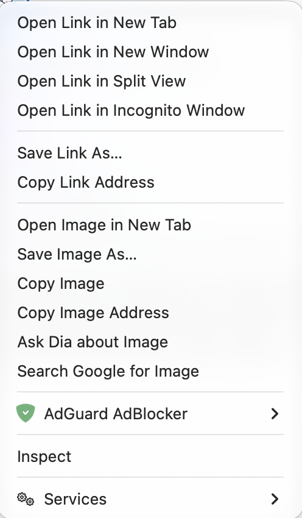

# rightweak
 

## a. purpose
when you load up your favourite version of [chromium](https://www.chromium.org/chromium-projects/) and its dependent projects (including, but not limited to: dia, brave, opera (suite), microsoft edge, vivalidi, arc, ungoogled-chromium, epic privacy browser, srware iron, samsung internet, naver whale, coc coc, yandex, and much more), and you dare use the right click button to perform special tasks, you will be greeted with a visually unfriendly and unsightly menu bar, which is barely functional. (See Figure 1.)

Figure 1

 
This display gets horrendously worse when right clicking upon an image. (See Figure 2.)

Figure 2

In this menu, it is hard to quickly find the wanted tasks and items, which may be summarised into the following.
- Download image as PNG
- Copy image as PNG
- Remove background, and download as PNG
- Remove background, and copy as PNG
- Open the image in a new tab

 
In addition when text has been selected, there are only a few actions that one would want to take.

- Copy link to highlight selection, and
- Look up text

These selections are often buried alive alongside many other choices, including the array of "Open link" which does not open the image, but rather the webpage that has the image, which sometimes, may not occur within the page.

In addition, these buttons appear to be very small, which makes it harder to accurately point with larger screens, inaccurate tracking surfaces (eg. mouse vs trackpad).

\therefore, a solution has been devised!

## b. name
rightweak $\sim$ right weak, but the true definition is
`right (click) tweaks`

## c. to use
at the present minute, we do not have a chrome extensions page. Please see instructions under the latest release.
