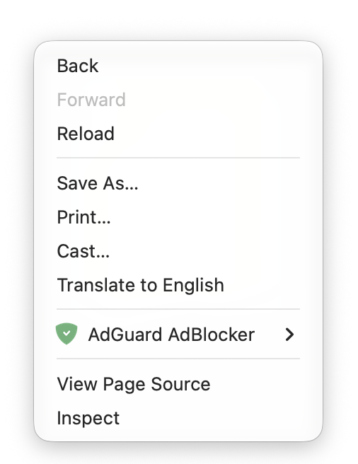

# rightweak

## a. purpose
when you load up your favourite version of [chromium](https://www.chromium.org/chromium-projects/) and its dependent projects (including, but not limited to: dia, brave, opera (suite), microsoft edge, vivalidi, arc, ungoogled-chromium, epic privacy browser, srware iron, samsung internet, naver whale, coc coc, yandex, and much more), and you dare use the right click button to perform special tasks, you will be greeted with a visually unfriendly and unsightly menu bar, which is barely functional. (See Figure 1.)

Figure 1